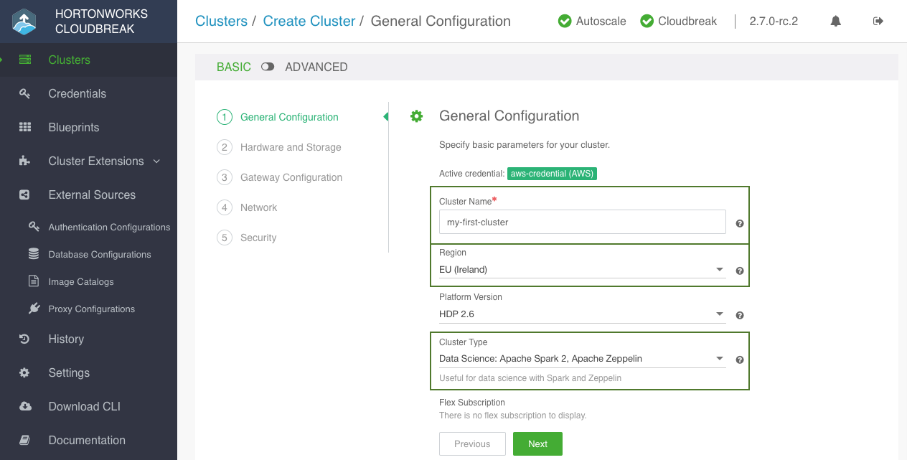
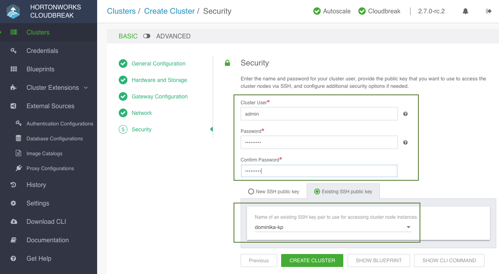

Use these steps to create a cluster. This section only covers minimal steps required for creating a cluster based on the basic settings (2-node cluster with default hardware and storage options).  

**Steps**

1. Click the **Create Cluster** button and the *Create Cluster* wizard is displayed.  
    By default, **Basic** view is displayed.

      

3. On the **General Configuration** page:

    * **Cluster Name**: Enter a name for your cluster. The name must be between 5 and 40 characters, must start with a letter, and must only include lowercase letters, numbers, and hyphens.
    * **Region**: Select the region in which you would like to launch your cluster. 
    * **Cluster Type**: Choose one of default cluster configurations.  

4. Click **Next** three times to navigate to the **Security Page**. You do not need to enter anything on the **Hardware and Storage** and **Network** because by default Cloudbreak suggests the instance types, storage, and network to use (a new network and subnet is created by default).   

5. One the **Security** page, provide the following:

    * **Cluster User**: This will be the user that you should use to log in to Ambari and other cluster UIs. By default, this is `admin`.   
    * **Cluster Password**: Password for the cluster user.  
    * **SSH public key**: Select the existing public SSH key or paste your key. The key will be placed on the cluster VMs so that you can use the matching private key to access the VMs via SSH. 

      

6. Click on **Create Cluster** to create a cluster.

7. You will be redirected to the Cloudbreak dashboard, and a new tile representing your cluster will appear at the top of the page.

 
### Next steps

To learn how to access your cluster, refer to [Accessing a cluster](clusters-access.md).

To learn how to use Cloudbreak to manage your cluster, refer to  [Managing and monitoring clusters](clusters-manage.md).

