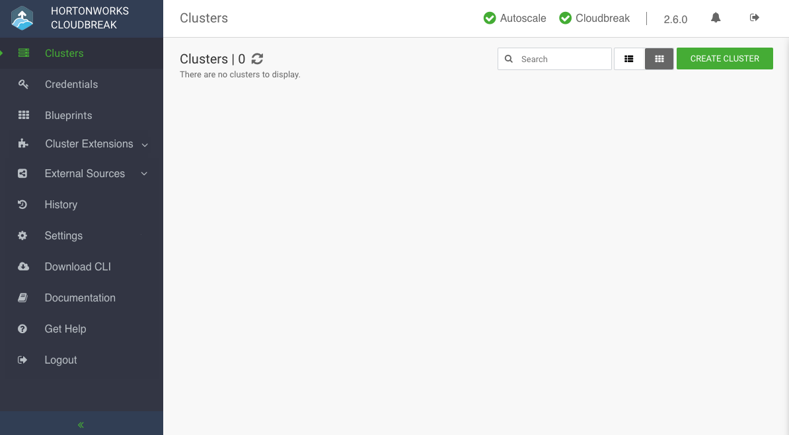

### Install Cloudbreak on a VM

Install Cloudbreak using the following steps.

**Steps**

1. Install the Cloudbreak deployer and unzip the platform-specific single binary to your PATH. For example:

    <pre>yum -y install unzip tar
curl -Ls public-repo-1.hortonworks.com/HDP/cloudbreak/cloudbreak-deployer_2.7.0_$(uname)_x86_64.tgz | sudo tar -xz -C /bin cbd
cbd --version</pre>

    Once the Cloudbreak deployer is installed, you can set up the Cloudbreak application.

2. Create a Cloudbreak deployment directory and navigate to it:

    <pre>mkdir cloudbreak-deployment
cd cloudbreak-deployment</pre>

3. In the directory, create a file called `Profile` with the following content:

    <pre>export UAA_DEFAULT_SECRET=MY-SECRET
export UAA_DEFAULT_USER_PW=MY-PASSWORD
export UAA_DEFAULT_USER_EMAIL=MY-EMAIL
export PUBLIC_IP=MY_VM_IP</pre>

    For example:

    <pre>export UAA_DEFAULT_SECRET=MySecret123
export UAA_DEFAULT_USER_PW=MySecurePassword123
export UAA_DEFAULT_USER_EMAIL=dbialek@hortonworks.com
export PUBLIC_IP=172.26.231.100</pre>

    You will need to provide the email and password when logging in to the Cloudbreak web UI and when using the Cloudbreak CLI. The secret will be used by Cloudbreak for authentication.
    
    You should set the CLOUDBREAK_SMTP_SENDER_USERNAME variable to the username you use to authenticate to your SMTP server. You should set the CLOUDBREAK_SMTP_SENDER_PASSWORD variable to the password you use to authenticate to your SMTP server.

4. Generate configurations by executing:

    <pre>rm *.yml
cbd generate</pre>   

    The cbd start command includes the cbd generate command which applies the following steps:

    * Creates the `docker-compose.yml` file, which describes the configuration of all the Docker containers required for the Cloudbreak deployment.  
    * Creates the `uaa.yml` file, which holds the configuration of the identity server used to authenticate users with Cloudbreak.   

5. Start the Cloudbreak application by using the following commands:

    <pre>cbd pull-parallel
cbd start</pre>

    This will start the Docker containers and initialize the application. The first time you start the Cloudbreak app, the process will take longer than usual due to the download of all the necessary docker images.
    
    > If you encounter errors during `cbd start`, refer to [Toubleshooting](trouble-cb.md).  

5. Next, check Cloudbreak application logs:

    <pre>cbd logs cloudbreak</pre>

    You should see a message like this in the log: `Started CloudbreakApplication in 36.823 seconds.` Cloudbreak normally takes less than a minute to start.

**Related links**  
[Toubleshooting](trouble-cb.md)   

### Access Cloudbreak web UI

Log in to the Cloudbreak UI using the following steps.

**Steps** 

1. You can log into the Cloudbreak application at `https://IP_Address`. For example `https://34.212.141.253`. You may use `cbd start` to obtain the login information. Alternatively, you can obtain the VM's IP address from your cloud provider console. 

{!docs/common/launch-access-ui.md!} 
    
4. Log in to the Cloudbreak web UI using the credentials that you configured in your `Profile` file:

    * The username is the `UAA_DEFAULT_USER_EMAIL`     
    * The password is the `UAA_DEFAULT_USER_PW` 

5. Upon a successful login, you are redirected to the dashboard:

      
    

### Configure external Cloudbreak database

By default, Cloudbreak uses an embedded PostgreSQL database to persist data related to Cloudbreak configuration, setup, and so on. For a production Cloudbreak deployment, you must [configure an external database](cb-db.md).

**Related links**  
[Configure an external database](cb-db.md)  
