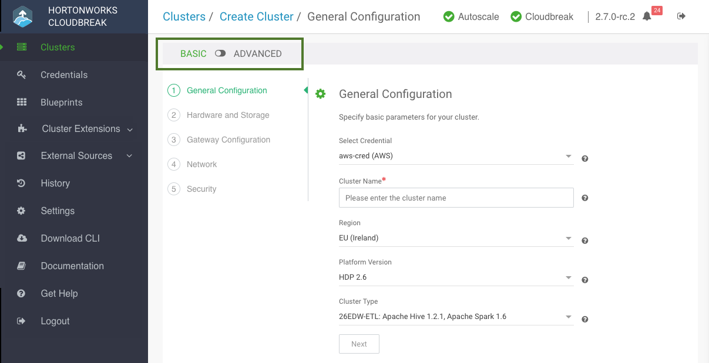

Use these steps to create a cluster.

Troubleshooting cluster creation

If you experience problems during cluster creation, refer to <a href="../trouble-cluster/index.html">Troubleshooting cluster creation</a>.

**Steps**

1. Log in to the Cloudbreak UI.

2. Click the **Create Cluster** button and the *Create Cluster* wizard is displayed.  
    By default, **Basic** view is displayed. To view advanced options, click **Advanced**. To learn about advanced options, refer to [Advanced cluster options](#advanced-cluster-options).

     

3. On the **General Configuration** page, specify the following general parameters for your cluster:

    | Parameter | Description |
|---|---|
| Select Credential | Choose a previously created credential. |
| Cluster Name | Enter a name for your cluster. The name must be between 5 and 40 characters, must start with a letter, and must only include lowercase letters, numbers, and hyphens. |