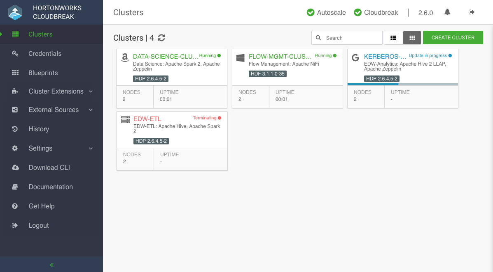

# Introduction 简介

欢迎来到 **Cloudbreak 2.8.0 TP** 文档！

 **Cloudbreak** 简化了虚拟环境和云环境中，按需HDP和HDF集群的 **配置(provisioning)** 、 **管理(management)** 和 **监控(monitoring)** 过程。 它利用 **云基础架构(cloud infrastructure)** 来创建 **主机实例(host instances)** ，并通过 **Ambari蓝图(blueprints)** ，使用 **Apache Ambari** 来配置和管理 **Hortonworks集群** 。

**Cloudbreak** 允许您使用 **Cloudbreak网页UI** 、 **Cloudbreak CLI** 或 **Cloudbreak REST API** 来创建集群。 集群可以在 **公共云基础架构平台(public cloud infrastructure platforms)** 上启动，包括 **Microsoft Azure** 、 **Amazon Web Services（AWS）** 和 **Google Cloud Platform（GCP）** ）以及 **私有云基础架构平台（OpenStack）** 。

## Primary use cases 主要用例

Cloudbreak允许您在所选的云平台(cloud platform)上创建、管理和监控HDP和HDF集群：

* 在 **公共云** 和 **私有云（AWS，Azure，Google Cloud，OpenStack）** 上动态地 **部署** 、 **配置** 和 **管理集群** 。
* 随着集群工作负载的变化，使用 **自动伸缩(automated scaling)** 功能来无缝地管理弹性需求。
* 通过启用 **Kerberos** 来保护您的集群。

## Architecture 结构

参阅[结构](1.2-architecture-结构.md)文档。

## Core concepts 核心概念

参阅[核心概念](1.3-core-concepts-核心概念.md)文档。 

## Deployment options 部署选项

通常，Cloudbreak提供两种部署选项： **快速入门(quickstart)** 选项和 **生产部署(production deployment)** 选项，详情参阅[部署选项](1.4-deployment-options-部署选项.md)文档。

## Default cluster configurations 默认集群配置

Cloudbreak包含默认的（ *蓝图blueprints* 形式的）集群配置，并支持您（以 *自定义蓝图custom blueprints* 的形式）使用自己的自定义集群配置。

可以使用以下默认集群配置：

平台版本： **HDP 2.6**

| 集群类型 Cluster type  | 主要服务 Main services | 描述 Description |  所包含所有服务的列表 List of all services included |
|---|---|---|---|
| 数据科学 Data Science | <i class="fa fa-check" style="color: green"></i> Spark 2, Zeppelin | 适用于使用Park 2 和Zeppelin的数据科学。 | HDFS, YARN, MapReduce2, Tez, Hive, Pig, Sqoop, ZooKeeper, Ambari Metrics, Spark 2, Zeppelin |
| EDW - Analytics | <i class="fa fa-check" style="color: green"></i> Hive 2 LLAP, Zeppelin | 适用于使用Hive LLAP的ENW分析 | HDFS, YARN, MapReduce2, Tez, Hive 2 LLAP, Druid, Pig, ZooKeeper, Ambari Metrics, Spark 2 |
| EDW - ETL | <i class="fa fa-check" style="color: green"></i> Hive,  Spark 2 | 适用于使用 Hive 和 Spark 2 的 ETL 数据处理  | HDFS, YARN, MapReduce2, Tez, Hive, Pig, ZooKeeper, Ambari Metrics, Spark 2 |

平台版本： **HDF 3.1**

| 集群类型 Cluster type  | 主要服务 Main services | 描述 Description |  包含的服务 List of all services included |
|---|---|---|---|
| 流管理 Flow Management | <i class="fa fa-check" style="color: green"></i> NiFi | 适用于使用NiFi的流管理。 | NiFi, NiFi Registry, ZooKeeper, Ambari Metrics |
| 消息管理 Messaging Management | <i class="fa fa-check" style="color: green"></i> Kafka |  适用于使用Kafka的消息管理。 | Kafka, ZooKeeper, Ambari Metrics |

## Get started 入门

要快速开始使用Cloudbreak，请使用 **快速入门(quickstart)** 部署选项，该选项允许您从 **模板(template)** 启动Cloudbreak：

* [AWS入门](2.1-aws-quick-AWS快速入门.md)  
* [Azure入门](2.2-azure-quick-Azure快速入门.md) 
* [GCP入门](2.3-gcp-quick-GCP快速入门.md)  

> 此选项不适用于 **OpenStack**; 如[在OpenStack上启动](6.2-os-launch-在OpenStack中启动Cloudbreak.md)中所述，若要在OpenStack上使用，您必须手动启动Cloudbreak。

在满足所有先决条件的情况下，可以从 *模板(template)* 启动Cloudbreak并创建 *Cloudbreak票据 (Cloudbreak credential)* ，之后您便可以基于其中一个 *默认蓝图(blueprints)* 来创建集群。

    
注：

    
Cloudbreak软件将在您的云环境(cloud environment)中运行。您将需要负责在Cloudbreak运行时，以及Cloudbreak管理集群时产生的云基础架构(cloud infrastructure)相关费用。

