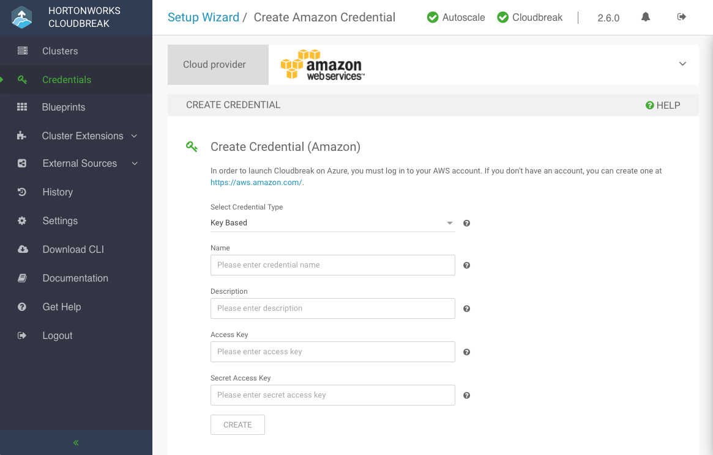

**Prerequisites**

In order to use the key-based Cloudbreak credential: 

* You must have an access key and secret key. For information on how to generate it, refer to [Use key-based authentication](aws-pre.md#option-1-use-key-based-authentication).  

* Your AWS user must have the minimum permissions described in [Create CredentialRole](aws-pre.md#create-credentialrole) as well as the permission to create an IAM role. 

If you are unable to obtain these permissions for your AWS user, you must use [role-based authentication](aws-pre.md#option-2-configure-role-based-authentication) instead of key-based authentication. If you would like to review both options, refer to [Authentication](aws-pre.md#authentication). 
    
**Steps**

1. In the Cloudbreak web UI, select **Credentials** from the navigation pane. 

2. Click **Create Credential**. 

3. Under **Cloud provider**, select "Amazon Web Services":

      

3. Provide the following information:

    | Parameter | Description |
|---|---|
| Select Credential Type | Select **Key Based**. | 
| Name | Enter a name for your credential. |
| Description | (Optional) Enter a description. | 
| Access Key | Paste your access key. |
| Secret Access Key | Paste your secret key. |
 
4. Click **Create**.

5. Your credential should now be displayed in the **Credentials** pane.

    
    Congratulations! You've successfully launched Cloudbreak and create a Cloudbreak credential. Now you can start creating clusters. 
    
**Related links**   
[Authentication](aws-pre.md#authentication)  
[Use key-based authentication](aws-pre.md#option-1-use-key-based-authentication)    
[Use role-based authentication](aws-pre.md#option-2-configure-role-based-authentication)     
[Create CredentialRole](aws-pre.md#create-credentialrole)  
