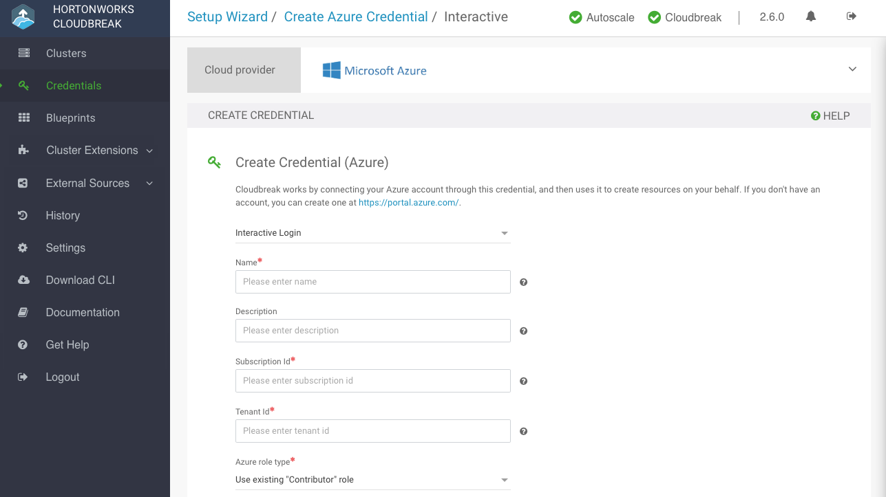

Follow these steps to create an interactive Cloudbreak credential.

**Prerequisites**

Your account must have have an Owner role in order for the interactive credential creation to work.   

If your account does not have an Owner role, you must you the [app-based credential](azure-launch.md#create-app-based-credential) option instead of the interactive option. To review the requirements for both options. refer to [Azure roles](azure-pre.md#azure-roles). 

**Steps**

1. In the Cloudbreak web UI, select **Credentials** from the navigation pane.

2. Click **Create Credential**.

3. Under **Cloud provider**, select "Microsoft Azure".

4. Select **Interactive Login**:

         

5. Provide the following information:

    | Parameter | Description |
|---|---|
| Name | Enter a name for your credential. |
| Description | (Optional) Enter a description. |
| Subscription Id | Copy and paste the Subscription ID from your **Subscriptions**. |
| Tenant Id | Copy and paste your Directory ID from your **Active Directory** > **Properties**. |
| Azure role type | 
You have the following options:<ul><li>"Use existing Contributor role" (default): If you select this option, Cloudbreak will use the "[Contributor](https://docs.microsoft.com/en-us/azure/active-directory/role-based-access-built-in-roles#contributor)" role to create resources. This requires no further input.</li><li>"Reuse existing custom role": If you select this option and enter the name of an existing role, Cloudbreak will use this role to create resources.</li><li>"Let Cloudbreak create a custom role": If you select this option and enter a name for the new role, the role will be created. When choosing role name, make sure that there is no existing role with the name chosen. For information on creating custom roles, refer to [Azure](https://docs.microsoft.com/en-us/azure/active-directory/role-based-access-control-custom-roles) documentation. </li></ul>

If using a custom role, make sure that it includes the necessary Action set for Cloudbreak to be able to manage clusters: `Microsoft.Compute/*`, `Microsoft.Network/*`, `Microsoft.Storage/*`, `Microsoft.Resources/*`.
 |

    To obtain the **Subscription Id**:

        

    To obtain the **Tenant ID** (actually **Directory Id**):

        

6. After providing the parameters, click **Interactive Login**.

6. Copy the code provided in the UI:

         

7. Click **Azure login** and a new **Device login** page will open in a new browser tab:

       

8. Next, paste the code in field on the  **Device login** page and click **Continue**.
9. Confirm your account by selecting it:

     

10. A confirmation page will appear, confirming that you have signed in to the Microsoft Azure Cross-platform Command Line Interface application on your device. You may now close this window.

    > If you encounter errors, refer to [Troubleshooting Azure](trouble-azure.md).

     Congratulations! You've successfully launched and configured Cloudbreak. Now you can use Cloudbreak to create clusters.

**Related links**  
[Create app-based credential](azure-launch.md#create-app-based-credential)   
[Azure roles](azure-pre.md#azure-roles)  
[Troubleshooting Azure](trouble-azure.md)  
[Contributor](https://docs.microsoft.com/en-us/azure/active-directory/role-based-access-built-in-roles#contributor) (External)  
[Custom roles in Azure](https://docs.microsoft.com/en-us/azure/active-directory/role-based-access-control-custom-roles) (External)  
